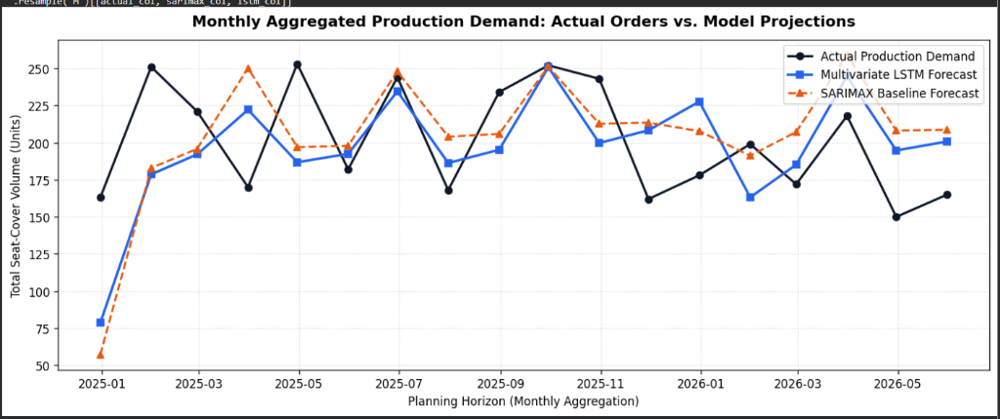
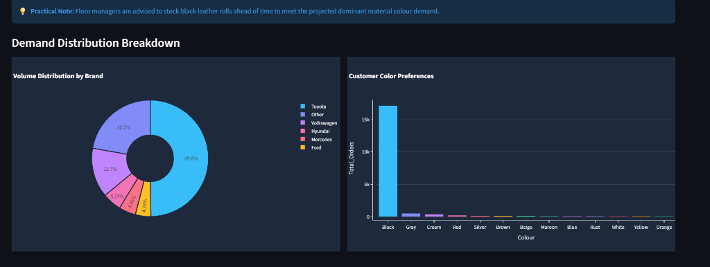

# 🏎️ AutoLeather Intelligence — Factory Demand & Upholstery DSS


## Executive Summary

**AutoLeather Intelligence** is a machine learning-driven Decision Support System (DSS) developed for an automotive leather upholstery manufacturing plant. The system is engineered to solve critical operational bottlenecks surrounding raw material procurement lead times and manual cutting schedules. 

By integrating advanced predictive analytics into a unified executive dashboard, this repository provides floor managers and procurement officers with data-driven foresight. It enables strategic inventory planning, reduces stockouts, and optimizes the allocation of labor and raw hide inventory across the cutting and sewing operations.

---

## Core Architecture & Machine Learning Models

The predictive engine of the DSS relies on comparing classical econometric forecasting against modern deep learning architectures. 

1. **Baseline SARIMAX:** An autoregressive integrated moving average model with exogenous variables. It establishes a strong baseline by accounting for inherent calendar seasonality, autoregressive trends, and exogenous shocks (e.g., COVID-19 supply chain disruptions).
2. **Multivariate LSTM (Long Short-Term Memory):** A recurrent neural network architecture designed to capture complex, non-linear dependencies in the demand sequence over time, utilizing the same multivariate exogenous signals.

### Benchmark Performance (Test Horizon)

The models were evaluated over a hold-out test horizon. Smoothing the high-frequency weekly noise into monthly procurement commitments yields the following performance metrics:

| Model | Aggregation Level | WAPE (Weighted Absolute Percentage Error) | MAPE (Mean Absolute Percentage Error) |
|:---|:---:|:---:|:---:|
| **Multivariate LSTM** | Monthly | **18.69%** | **19.54%** |
| **SARIMAX Baseline** | Monthly | 19.79% | 21.46% |

The LSTM neural network serves as the primary production planner engine, consistently outperforming the econometric baseline.

---

## Key Decision Support System (DSS) Modules & Visual Insights

The Streamlit dashboard (`app.py`) is organized into several strategic modules to facilitate rapid decision-making.

### Executive KPIs
Immediate planning targets are synthesized into custom CSS-styled metric tiles:
* **Next Month Target:** 186 seat-cover units projected for cutting and stitching in June 2026.
* **Top Vehicle Make:** Toyota (Leading OEM Inflow).
* **Leather Hide Preference:** Black (Perforated / Smooth Hide).
* **Forecast Model:** LSTM Neural Net (Production Planner Engine).

### Multi-Model Forecast Canvas
**

An interactive visualization comparing Actual Demand against the predicted curves of the LSTM and SARIMAX models. The module allows operations managers to toggle between high-fidelity **Weekly Views** and smoothed **Monthly Views**, aligning directly with raw material procurement cycles.

### Customer & Portfolio Diagnostics
**

* **OEM Brand Breakdown:** A donut chart highlighting market share concentration (e.g., Toyota at 49.8%, Volkswagen at 13.7%, Hyundai at 5.27%).
* **Raw Material Color Consumption:** A Pareto bar chart revealing extreme preference concentration, with Black leather hide commanding 91.7% of all inbound orders.

### Rolling 4-Week Production Schedule
A granular shop-floor target matrix detailing projected seat covers per week. This module is paired with automated heuristic replenishment alerts advising workshop managers to proactively secure dominant material stock.

---

## Repository Structure

```text
.
├── app.py                                  # Main Streamlit DSS dashboard application
├── dashboard_forecast_comparison.csv       # Time-series actuals and model predictions
├── dashboard_future_month_forecast.csv     # Rolling 4-week production targets
├── dashboard_brand_insights.csv            # Aggregated OEM brand volume and share
├── dashboard_color_insights.csv            # Aggregated hide color volume and share
├── Model_training_Auto_Leathers.ipynb      # Jupyter Notebook containing ML training pipelines
├── requirements.txt                        # Python dependencies
└── README.md                               # Project documentation
```

---

## Local Setup & Execution

To run the AutoLeather Intelligence dashboard on your local machine, follow these instructions:

1. **Clone the repository:**
   ```bash
   git clone https://github.com/ashrafatoosa-cmyk/Auto-Leather-Demand.git
   cd Auto-Leather-Demand
   ```

2. **Install the required dependencies:**
   ```bash
   pip install -r requirements.txt
   ```

3. **Launch the Streamlit DSS:**
   ```bash
   streamlit run app.py
   ```
   
The dashboard will automatically open in your default web browser at `http://localhost:8501`.
